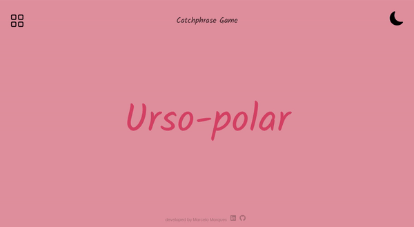

# Catchphrase Game

> This is a personal project! 

The objective is to create a <strong>"Catchphrase Game"</strong>, in which the player is given a random expression on the screen and then provides hints for their partner to guess the expression, before time's out.

### Desenvolvido com / Built With:
<!-- https://github.com/Ileriayo/markdown-badges -->

### Application Demo:
 

 

The inspiration comes from the game played on *"The Tonight Show Starring Jimmy Fallon"*.

  <a href="https://www.youtube.com/playlist?list=PLykzf464sU9_6d0zR4E2of1z6nFNwJqhr" target="_blank">
    Click here to see on YouTube!
  </a>

